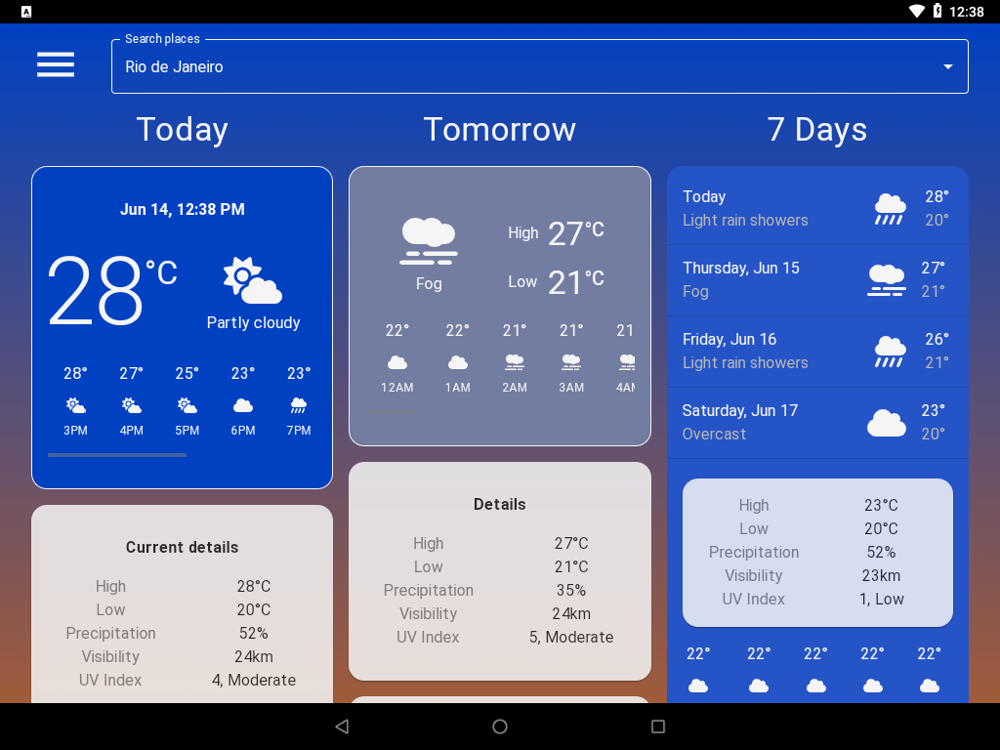

# Weather App

App: <a href="https://brianwoo.github.io/weather-app">Hosted here</a>

Introducing the Weather App, your ultimate companion for weather updates and forecasts! Designed to keep you informed and prepared for any weather condition, The Weather App is a powerful and user-friendly application that brings you accurate and real-time weather information right at your fingertips.

One of the standout features of the Weather App is its precise weather forecasts. Powered by the Open-Meteo API, you can trust that the app will provide you with accurate predictions for the current conditions, as well as detailed forecasts for the coming hours, days, and week. Stay ahead of changing weather patterns and make informed decisions with the help of the Weather App.

 

## Screenshots
### Mobile view

### Tablet view

## Privacy Policy
We do not collect personal or usage data from our users.

